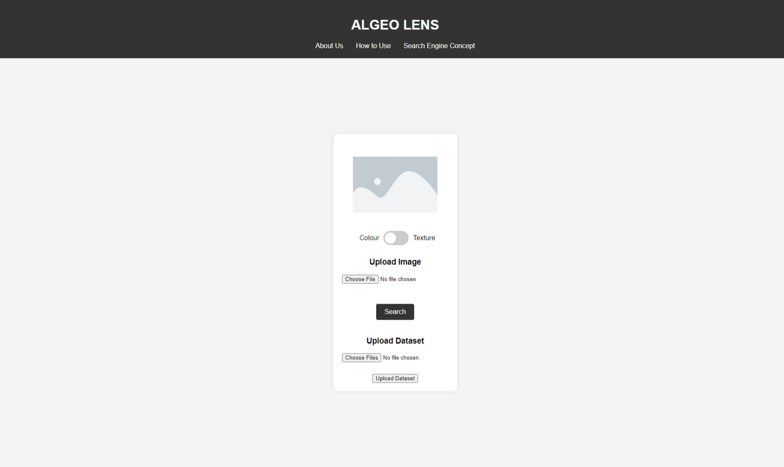
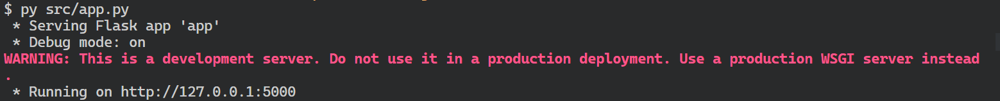

# Aplikasi Aljabar Vektor dalam Sistem Temu Balik Gambar

> Tugas Besar Aljabar Linier dan Geometri Kelas 02 Kelompok Algeo Lens **[Algeo02-22061]**
> 
> Oleh Kelompok Algeo Lens:<br>
> 1. 13522061 Maximilian Sulistiyo<br>
> 2. 13522083 Evelyn Yosiana<br>
> 3. 13522094 Andhika Tantyo Anugrah<br>
> 
> Sekolah Teknik Elektro dan Informatika<br>
> Institut Teknologi Bandung<br>
> Semester III Tahun 2023/2024


## Table of Contents
* [General Info](#general-information)
* [Libraries Used](#libraries-used)
* [Features](#features)
* [Screenshots](#screenshots)
* [Setup](#setup)
* [Usage](#usage)
* [Project Status](#project-status)
* [Room for Improvement](#room-for-improvement)
* [Acknowledgements](#acknowledgements)
* [Links](#links)


## General Information
This is the vector algebra implementation of reverse image search tool. The vector algebra is used for describing and analyzing data using Content-Based Image Retrieval (CBIR). This project is intended to solve the reverse image search problem using vector algebra contained in a website. The purpose of this project is to fulfill the assignment given by the lecturer's assistants. We undertake this project because this project is mandatory to our final scores.


## Libraries Used
- flask (3.0.0)
- opencv-python (4.8.1.78)
- numpy (1.26.1)
- pillow (10.1.0)
- fpdf (1.7.2)


## Features
Reverse Image Search with:
- CBIR with color parameter
- CBIR with texture parameter
- Export results in PDF


## Screenshots



## Setup

Needs Python (py) in order to run. Python can be found at [their website](https://www.python.org/downloads/). It also needs numpy library, bla bla, and bla bla that are listed in the requirements file. The requirements.txt file is located at the src folder. To automatically installed all of the modules required, simply copy and paste these lines into your terminal.

```shell
pip install -r src/requirements.txt
```

I know when using pip, it’s good practice to use a virtual environment, but I don't care right now. So, happy developing :D


## Usage

There are no additional steps for the developer to build the project after some code changes, just save it, then run it.

```shell
python src/app.py
```
Then python will host the website locally like the following image:


Here, the website is hosted locally, press <kbd>Ctrl</kbd> + <kbd>click</kbd> on the  <em>http://127.0.0.1:5000</em>


## Project Status
Project is: _in progress_.


## Room for Improvement

Room for improvement:
- Impove the UI/UX

To do:
- Improve Website's FrontEnd and BackEnd


## Acknowledgements
- This project was based on [Spesifikasi Tugas Besar 2 IF2123 Algeo 2023/2024](https://docs.google.com/document/d/1HVDyywnUdNz9hStgx5ZLqHypK89hWH8qfERJOiDw6KA/edit).
- Many thanks to everyone who's helped us in developing this assignment.


## Links
- [Spesifikasi Tugas Besar 2 IF2123 Algeo 2023/2024](https://docs.google.com/document/d/1HVDyywnUdNz9hStgx5ZLqHypK89hWH8qfERJOiDw6KA/edit).
- [This Repository](https://github.com/riyorax/Algeo02-22061)
- [The Report [email std]](https://docs.google.com/document/d/1MDdhX6vOATXgypNhPfJXa2OcuCtfw7UXOzsRt0Tfzss/edit?usp=sharing)